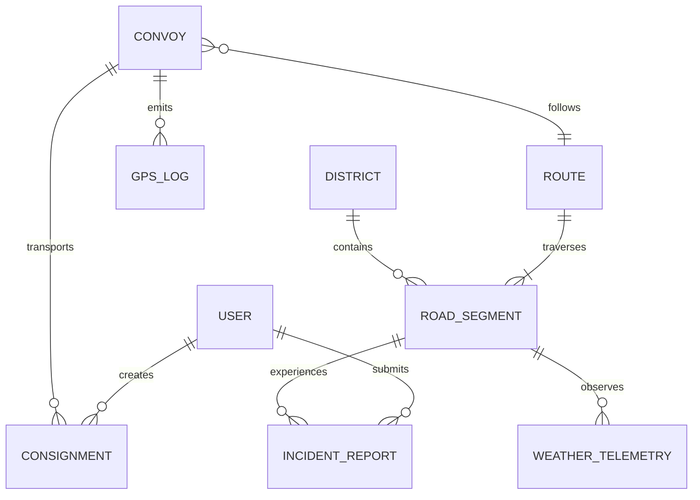

# System Architecture & Technical Design Document (Design.md)

## Project Title: AURA-NER (SIH26002)
**AI-Enabled Smart Logistics & Accessibility Intelligence Platform for North Eastern Region**

---

## 1. High-Level Architecture Overview

AURA-NER follows a **Decoupled Enterprise 3-Tier Architecture**:
1. **Presentation Layer:** Pure React 18 (Vite SPA) + React Router 6 + Tailwind CSS + Mapbox GL / Leaflet (GIS Visualization) + Service Workers (PWA for Offline Sync).
2. **Enterprise Core & Orchestration Layer:** Spring Boot 3.x (Java 21) handling Authentication, Role-Based Access Control, Spatial GIS Queries (PostGIS), WebSocket Telemetry Streaming, Consignment Lifecycles, and Incident Workflows.
3. **AI / Analytics Microservice:** Python FastAPI microservice executing XGBoost Disruption Models, SHAP Explainability computations, and Perishable Spoilage Predictions.
4. **Data & Caching Tier:** PostgreSQL 16 + PostGIS (Spatial Data), Redis 7 (Live GPS telemetry caching and pub/sub), and Object Storage (S3-compatible / MinIO for incident photos).

```
                      ┌─────────────────────────────────────────────────────────┐
                      │              CLIENT / PRESENTATION TIER                 │
                      │  • React 18 SPA (Vite) + React Router + Tailwind CSS    │
                      │  • Mapbox GL / Leaflet.js (3D Terrain & GIS Corridors) │
                      │  • PWA (Service Workers + IndexedDB Offline Storage)   │
                      └────────────────────────────┬────────────────────────────┘
                                                   │
                                                   │ HTTPS (REST) / WSS (WebSocket STOMP)
                                                   ▼
                      ┌─────────────────────────────────────────────────────────┐
                      │            SPRING BOOT 3.x BACKEND CORE                 │
                      │  • Spring Cloud Gateway / Security (JWT & RBAC)         │
                      │  • Spring Data JPA + PostGIS (Spatial Road Network)     │
                      │  • Spring WebSocket / STOMP (Live Telemetry Push)       │
                      │  • OptaPlanner / Route Multi-Modal Engine               │
                      │  • Spring Batch (Weather Ingestion & Geo-hazard Sync)   │
                      │  • OpenPDF (Digital e-Waybills & Official Reports)      │
                      └──────────────┬───────────────────────────┬──────────────┘
                                     │                           │
                   Internal REST/gRPC│                           │ JDBC / Redis Protocol
                                     ▼                           ▼
        ┌────────────────────────────────────────┐ ┌────────────────────────────────────────┐
        │       PYTHON AI / ML MICROSERVICE      │ │             DATA TIER                  │
        │  • FastAPI + Uvicorn                   │ │  • PostgreSQL 16 + PostGIS             │
        │  • XGBoost (Road Disruption Risk)      │ │    (Roads, Incidents, Convoys)         │
        │  • SHAP (Explainability Engine)        │ │  • Redis 7 (Live GPS & Pub/Sub)        │
        │  • Perishable Decay Estimator (TTI)    │ │  • MinIO / S3 (Geo-tagged Photos)      │
        └────────────────────────────────────────┘ └────────────────────────────────────────┘
```

---

## 2. Database Schema Design (PostgreSQL + PostGIS)

### 2.1 Entity Relationship Diagram (ERD)



### 2.2 Core PostgreSQL Tables

```sql
-- 1. Districts of NER
CREATE TABLE districts (
    id VARCHAR(36) PRIMARY KEY,
    name VARCHAR(100) NOT NULL,
    state VARCHAR(50) NOT NULL,
    boundary_geom GEOMETRY(MultiPolygon, 4326),
    connectivity_status VARCHAR(20) DEFAULT 'NORMAL', -- NORMAL, RESTRICTED, SEVERED
    criticality_score DOUBLE PRECISION DEFAULT 0.0,
    updated_at TIMESTAMP DEFAULT CURRENT_TIMESTAMP
);

-- 2. Road Segments & Corridors
CREATE TABLE road_segments (
    id VARCHAR(36) PRIMARY KEY,
    highway_code VARCHAR(50), -- e.g. NH-06, NH-29
    start_point_name VARCHAR(100),
    end_point_name VARCHAR(100),
    segment_geom GEOMETRY(LineString, 4326) NOT NULL,
    elevation_avg_m DOUBLE PRECISION,
    slope_angle_deg DOUBLE PRECISION,
    historical_landslide_count INT DEFAULT 0,
    bridge_count INT DEFAULT 0,
    max_weight_limit_tons DOUBLE PRECISION DEFAULT 40.0,
    current_status VARCHAR(20) DEFAULT 'OPEN', -- OPEN, CAUTION, BLOCKED, FLOODED
    current_risk_score DOUBLE PRECISION DEFAULT 0.0,
    last_risk_calculated_at TIMESTAMP
);

-- 3. Incident Reports (Crowdsourced / Field Engineers)
CREATE TABLE incident_reports (
    id VARCHAR(36) PRIMARY KEY,
    reporter_id VARCHAR(36) REFERENCES users(id),
    road_segment_id VARCHAR(36) REFERENCES road_segments(id),
    incident_type VARCHAR(50) NOT NULL, -- LANDSLIDE, FLASH_FLOOD, BRIDGE_DAMAGE, ROAD_CAVED_IN
    severity VARCHAR(20) NOT NULL, -- LOW, MODERATE, HIGH, CRITICAL
    location_geom GEOMETRY(Point, 4326) NOT NULL,
    photo_url VARCHAR(500),
    description TEXT,
    verification_status VARCHAR(20) DEFAULT 'PENDING', -- PENDING, VERIFIED, REJECTED, RESOLVED
    created_at TIMESTAMP DEFAULT CURRENT_TIMESTAMP,
    synced_from_offline BOOLEAN DEFAULT FALSE
);

-- 4. Essential Commodities Convoys
CREATE TABLE convoys (
    id VARCHAR(36) PRIMARY KEY,
    vehicle_number VARCHAR(30) NOT NULL,
    driver_name VARCHAR(100),
    driver_phone VARCHAR(20),
    commodity_type VARCHAR(50) NOT NULL, -- MEDICINES, FOOD_GRAINS, FUEL, PERISHABLE_AGRI, RELIEF_MATERIAL
    current_location GEOMETRY(Point, 4326),
    status VARCHAR(30) DEFAULT 'IN_TRANSIT', -- PLANNED, IN_TRANSIT, DELAYED, REROUTED, DELIVERED
    assigned_route_id VARCHAR(36),
    temperature_celsius DOUBLE PRECISION,
    created_at TIMESTAMP DEFAULT CURRENT_TIMESTAMP
);

-- 5. Real-Time GPS Logs
CREATE TABLE gps_telemetry_logs (
    id BIGSERIAL PRIMARY KEY,
    convoy_id VARCHAR(36) REFERENCES convoys(id),
    latitude DOUBLE PRECISION NOT NULL,
    longitude DOUBLE PRECISION NOT NULL,
    speed_kmh DOUBLE PRECISION,
    heading_deg DOUBLE PRECISION,
    altitude_m DOUBLE PRECISION,
    recorded_at TIMESTAMP NOT NULL
);
CREATE INDEX idx_gps_convoy_time ON gps_telemetry_logs(convoy_id, recorded_at DESC);
```

---

## 3. API Contract Specifications

### 3.1 REST Endpoints (Spring Boot Gateway)

#### A. Route Computation & Risk Assessment
* `POST /api/v1/routes/calculate`
  * **Request:** `{ "origin": {"lat": 26.14, "lng": 91.73}, "destination": {"lat": 25.57, "lng": 91.89}, "commodityType": "MEDICINES", "allowWaterways": true }`
  * **Response:** Returns list of route options with ETA, Distance, Multi-Modal steps, Risk Score, and XAI Explanations.

#### B. Incident Reporting & Field Sync
* `POST /api/v1/incidents/report` (Multipart Form: metadata + image)
* `POST /api/v1/incidents/batch-sync` (Ingests array of offline-cached reports from PWA).

#### C. Central Dashboard & GIS Analytics
* `GET /api/v1/analytics/district-connectivity` (Returns GeoJSON FeatureCollection with color-coded status for all 8 NER states).
* `GET /api/v1/convoys/active` (Returns live active essential supply vehicles with current delays and temperature stats).

### 3.2 WebSocket Streaming Protocol (STOMP over WSS)
* **Subscribe Topic:** `/topic/convoys/live` $\rightarrow$ Streams 1-second GPS location updates for active fleets.
* **Subscribe Topic:** `/topic/alerts/disruptions` $\rightarrow$ Pushes instant Red Alerts for new road washouts or severe weather spikes.

---

## 4. AI & Prediction Microservice Design

### 4.1 XGBoost Road Disruption Probability Model
* **Target:** $P(\text{Disruption} \mid \text{Segment Features}) \in [0.0, 1.0]$
* **Input Vector ($X$):**
  $$\mathbf{x} = [\text{Rain}_{24\text{h}}, \text{Rain}_{48\text{h}}, \text{SlopeDeg}, \text{SoilMoisture}, \text{Elevation}, \text{HistIncidents}, \text{BridgeRisk}]$$
* **Inference Pipeline:**
  1. Spring Boot queries Open-Meteo for 48h weather forecasts for each highway segment centroid.
  2. Passes batch segments to Python FastAPI `/api/predict-risk`.
  3. FastAPI runs XGBoost inference + computes SHAP local explanations.
  4. Returns risk matrix to Spring Boot for routing graph edge-weight recalculation.

### 4.2 Risk-Weighted Dijkstra / A* Routing Algorithm
Edge weight $W_e$ between node $u$ and node $v$ is dynamically formulated as:
$$W_e = D_e \times \left(1.0 + \alpha \cdot P_{\text{disruption}} + \beta \cdot S_{\text{slope}} + \gamma \cdot C_{\text{congestion}}\right)$$
* Where:
  * $D_e$: Base road distance (km).
  * $P_{\text{disruption}}$: Predicted failure probability ($0.0 - 1.0$).
  * $\alpha = 5.0$: Severe penalty coefficient for landslide/flood risk.
  * $S_{\text{slope}}$: Normalized slope factor.

---

## 5. Offline-First Synchronization Architecture (PWA)

```
[Field Device (Mobile Browser / PWA)]
        │
        ├──► User fills incident form & captures photo
        │
        ├──► Service Worker checks `navigator.onLine`
        │         │
        │         ├──[Online]───► Immediate POST to Spring Boot
        │         │
        │         └──[Offline]──► Write to IndexedDB (`pending_incidents` store)
        │
        └──► Connection Restored Event (`window.addEventListener('online')`)
                  │
                  └──► Background Sync triggered ──► POST `/api/v1/incidents/batch-sync`
```

---

## 6. Security, Deployment & Infrastructure

* **Containerization:** Multi-stage Dockerfiles for Spring Boot (Eclipse Temurin 21 Alpine) and Python AI (Python 3.11 Slim).
* **Orchestration:** `docker-compose.yml` defining `frontend`, `spring-backend`, `fastapi-ai`, `postgres-postgis`, `redis`, and `minio`.
* **Security Layer:** Spring Security 6 with JWT authentication, rate limiting via Bucket4j, and strict CORS policies.
